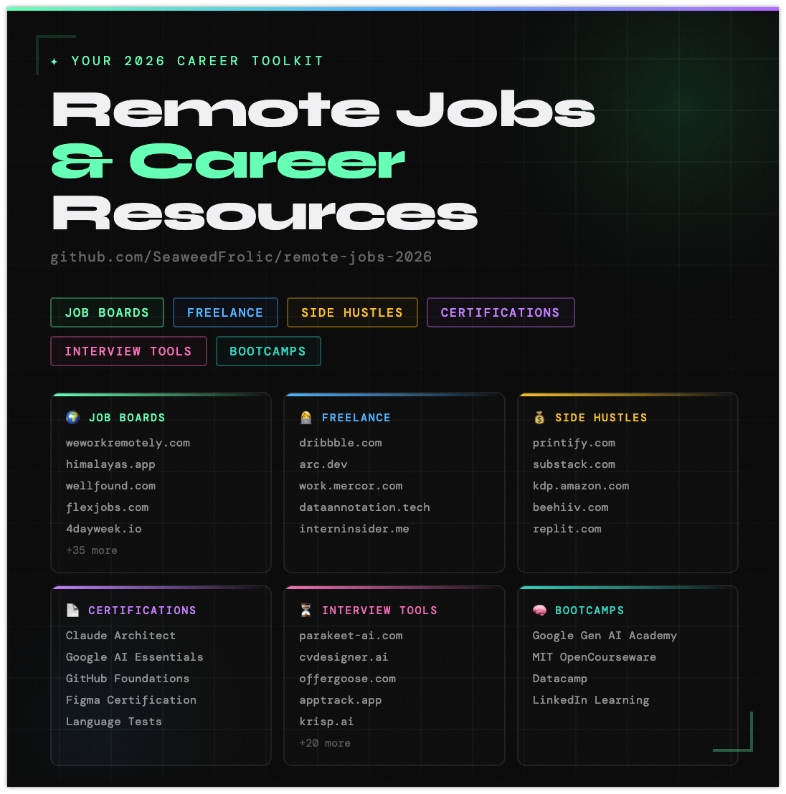

# remote-jobs-2026
Not gatekeeping — just sharing! 
I pulled together a curated list of over 40 Remote Job & Career Resources from my endless doom‑scrolling. Productive, right? :wink:
Figured it might be useful for you too:

# 🌍 2026 Curated List of Remote Job & Career Resources

A comprehensive and organized list of websites, platforms, and tools to help you **find remote jobs, internships, freelancing gigs, creative work, side hustles, and career growth opportunities worldwide**.  

---

## 💻 Remote Job Boards

| Website | Description |
|---------|-------------|
| [rareroles.com](https://www.rareroles.com) | Unique and niche remote job opportunities. |
| [opendoorscareers.com/jobs](https://opendoorscareers.com/jobs) | Global career portal with remote listings. |
| [virtualstaff.ph](https://virtualstaff.ph/en-ph/find-jobs) | Remote jobs tailored for Filipino professionals. |
| [jobs.cloudstaff.com](https://jobs.cloudstaff.com/job-list) | Outsourcing and remote staffing opportunities. |
| [connectos.co/careers](https://connectos.co/careers) | Remote careers in outsourcing and BPO. |
| [jobs.workable.com](https://jobs.workable.com) | Workable’s curated job marketplace. |
| [4dayweek.io](https://4dayweek.io) | Remote jobs with flexible 4-day workweeks. |
| [dataannotation.tech](https://dataannotation.tech) | AI data labeling and annotation jobs. |
| [wellfound.com](https://wellfound.com) | Startup-focused remote job listings. |
| [wethemakers.club](https://wethemakers.club) | Creative and design-focused job board. |
| [ifyoucouldjobs.com](https://ifyoucouldjobs.com) | Creative industry job opportunities. |
| [openrol.es](https://openrol.es) | Remote job aggregator with curated listings. |
| [builtin.com/jobs/remote](https://builtin.com/jobs/remote) | Tech-focused remote jobs. |
| [himalayas.app/jobs/remote](https://himalayas.app/jobs/remote) | Remote jobs worldwide with detailed filters. |
| [arc.dev/remote-jr-jobs](https://arc.dev/remote-jr-jobs) | Junior-level remote developer jobs. |
| [workingnomads.com/jobs](https://workingnomads.com/jobs) | Remote job aggregator for digital nomads. |
| [jobspresso.co](https://jobspresso.co) | Expertly curated remote jobs. |
| [weworkremotely.com](https://weworkremotely.com) | One of the largest remote job boards. |
| [nodesk.co](https://nodesk.co) | Remote jobs and digital nomad resources. |
| [trulyremote.co](https://trulyremote.co) | Verified remote job opportunities. |
| [remote100k.com](https://remote100k.com) | High-paying remote jobs ($100k+). |
| [remoteineurope.com](https://remoteineurope.com) | Remote jobs specifically in Europe. |
| [flexa.careers/jobs](https://flexa.careers/jobs) | Flexible and remote-friendly companies. |
| [theladders.com/jobs/design-jobs](https://theladders.com/jobs/design-jobs) | Design-focused job listings. |
| [the-brandidentity.com/jobs](https://the-brandidentity.com/jobs) | Creative and branding job opportunities. |
| [thedieline.com/jobs](https://thedieline.com/jobs) | Packaging and design industry jobs. |
| [jobs.girlboss.com](https://jobs.girlboss.com) | Empowering women-focused career portal. |
| [careervault.io](https://careervault.io) | Remote job aggregator with smart filters. |
| [justremote.co](https://justremote.co) | Global remote job search platform. |
| [remoteleaf.com](https://remoteleaf.com) | Curated remote jobs delivered to your inbox. |
| [remote.co](https://remote.co) | Remote work resources and job listings. |
| [dailyremote.com](https://dailyremote.com) | Daily updated remote job board. |
| [dynamitejobs.com](https://dynamitejobs.com) | Remote startup jobs. |
| [jobgether.com](https://jobgether.com) | Remote-first job search engine. |
| [flexjobs.com](https://flexjobs.com) | Premium vetted remote jobs. |
| [skipthedrive.com](https://skipthedrive.com) | Easy-to-search remote jobs. |
| [work.mercor.com](https://work.mercor.com) | Remote developer marketplace. |
| [generalist.world/jobs](https://generalist.world/jobs) | Jobs for versatile generalists. |
| [levels.fyi](https://levels.fyi) | Career transparency and job listings. |
| [venturecapitalcareers.com](https://venturecapitalcareers.com) | VC and startup-focused jobs. |

---

## 👩‍🎓 Paid Internships

| Website | Description |
|---------|-------------|
| [interninsider.me](https://interninsider.me) | Global paid internship opportunities. |

---

## 👩‍💻 Freelancing Platforms

| Website | Description |
|---------|-------------|
| [dribbble.com/for-designers](https://dribbble.com/for-designers) | Freelance gigs for designers. |
| [airbnb.com/s/experiences](https://airbnb.com/s/experiences) | Monetize skills via Airbnb Experiences. |

---

## 💼 On-Site Creative Work

| Website | Description |
|---------|-------------|
| [figma.com/careers](https://figma.com/careers) | Careers at Figma. |
| [lifeatcanva.com/en/jobs](https://lifeatcanva.com/en/jobs) | Creative roles at Canva. |
| [snappr.com/careers](https://snappr.com/careers) | Photography and creative jobs. |
| [sweetescape.com/en/join](https://sweetescape.com/en/join) | Travel photography careers. |
| [jobs.netflix.com](https://jobs.netflix.com) | Creative and media roles at Netflix. |
| [careers.penguinrandomhouse.com](https://careers.penguinrandomhouse.com) | Publishing industry jobs. |

---

## 💰 Side Hustles & Passive Income

| Website | Description |
|---------|-------------|
| [printify.com](https://printify.com) | Print-on-demand business. |
| [replit.com](https://replit.com) | Build and monetize apps. |
| [substack.com](https://substack.com) | Newsletter monetization. |
| [beehiiv.com](https://beehiiv.com) | Newsletter growth platform. |
| [cococart.co](https://cococart.co) | Simple online store builder. |
| [contributor.stock.adobe.com](https://contributor.stock.adobe.com) | Sell creative assets. |
| [web.nlp.gov.ph/isbn](https://web.nlp.gov.ph/isbn) | ISBN registration for publishing. |
| [kdp.amazon.com](https://kdp.amazon.com/en_US) | Self-publishing on Amazon. |
| [raket.ph](https://raket.ph) | Filipino freelancing and side gigs. |

---

## 📰 Instagram Job Tips & Postings

Follow these accounts for job tips and postings:  
- [@samssocialmediaclub](https://instagram.com/samssocialmediaclub)  
- [@resumeofficial101](https://instagram.com/resumeofficial101)  
- [@wethemakersjobs](https://instagram.com/wethemakersjobs)  
- [@openroles](https://instagram.com/openroles)  
- [@ifyoucouldjobs](https://instagram.com/ifyoucouldjobs)  
- [@thebrandidentityjobs](https://instagram.com/thebrandidentityjobs)  
- [@joinhandshake](https://instagram.com/joinhandshake)  
- [@wanacreate](https://instagram.com/wanacreate)  
- [@careerwithnatalia](https://instagram.com/careerwithnatalia)  

---

## 📄 Upskill Certifications

- Claude Certified Architect  
- Google AI Essentials  
- Github Foundations  
- Figma Certification  
- Foreign Language Proficiency Test  

---

## 🧠 Bootcamps

- Google Gen AI Academy  
- MIT OpenCourseware  
- Datacamp  
- Linkedin Learning  

---

## ⏳ Interview Preparation Tools

| Website | Description |
|---------|-------------|
| [parakeet-ai.com](https://parakeet-ai.com) | AI-powered interview practice. |
| [cvdesigner.ai](https://cvdesigner.ai) | Smart CV and resume builder. |
| [offergoose.com](https://offergoose.com) | Salary negotiation assistant. |
| [slidesgo.com](https://slidesgo.com) | Free presentation templates. |
| [keepmind.ai](https://keepmind.ai) | AI memory and productivity tool. |
| [moody.mjarosz.com](https://moody.mjarosz.com) | Mood tracking for interviews. |
| [krisp.ai](https://krisp.ai) | Noise cancellation for calls. |
| [apptrack.app](https://apptrack.app) | Job application tracker. |
| [plaud.ai](https://plaud.ai) | AI-powered note-taking. |
| [raindrop.io](https://raindrop.io) | Bookmark manager. |
| [wetransfer.com](https://wetransfer.com) | Simple file transfer service for sharing portfolios and resumes. |
| [endel.io](https://endel.io) | AI-powered soundscapes to improve focus and reduce stress. |
| [chatlyai.app](https://chatlyai.app) | AI chat assistant for interview practice and productivity. |
| [d-id.com](https://d-id.com) | AI-generated talking avatars for presentations. |
| [heygen.com](https://heygen.com) | Video creation platform with AI avatars. |
| [makeugc.ai](https://makeugc.ai) | AI tool for generating user-generated content mockups. |
| [synthesia.io](https://synthesia.io) | Create AI-powered video resumes and presentations. |
| [principles.design](https://principles.design) | Design principles library for better portfolio building. |
| [framer.com](https://framer.com) | Interactive design and prototyping tool. |
| [foriio.com](https://foriio.com) | Online portfolio platform for creatives. |
| [pop.site](https://pop.site) | Simple personal website builder for showcasing work. |
| [zaap.ai](https://zaap.ai) | AI-powered personal branding and portfolio tool. |
| [potofu.me](https://potofu.me) | Japanese portfolio and profile creation platform. |
| [lit.link](https://lit.link) | Link-in-bio tool for creatives and professionals. |
| [stillhiring.today](https://stillhiring.today) | Real-time updates on companies actively hiring. |

